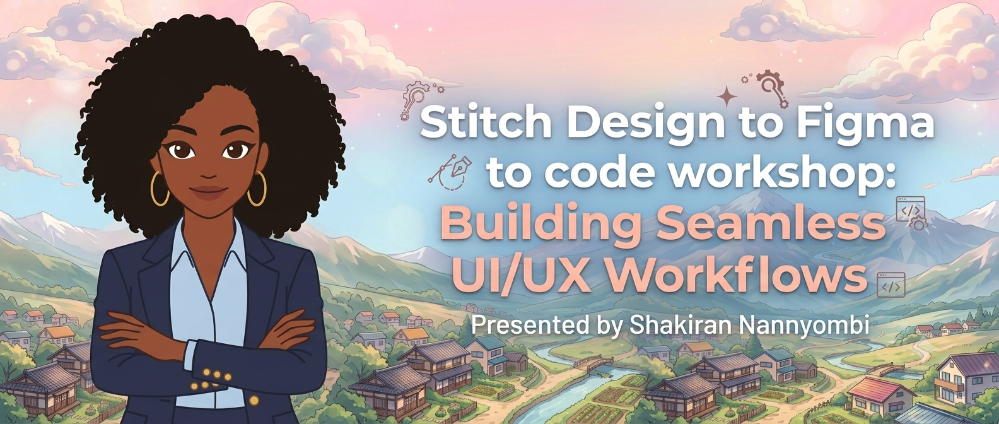

# 🌸 Anime-Themed Tech Portfolio

> A modern, highly responsive single-page portfolio website blending a clean tech aesthetic with vibrant anime-inspired design tokens. Featuring a custom illustrated character mascot across distinct structural layout sections.

<!-- PROJECT BANNER -->


---

## 🎨 Design System & Tokens

This project implements a dynamic light and dark theme using explicit custom CSS properties tailored around custom palettes:

```css
:root[data-theme="light"] {
  --text: #130109;
  --background: #fef1f7;
  --primary: #ef1570;
  --secondary: #f6807e;
  --accent: #f3644f;
}
:root[data-theme="dark"] {
  --text: #feecf4;
  --background: #0e0107;
  --primary: #ea106b;
  --secondary: #810b09;
  --accent: #b0220c;
}
```

**Typography Strategy:**

| Role | Font | Purpose |
|------|------|---------|
| **Headings** | `Space Grotesk` | Bold, geometric anime-tech feel |
| **Body Text** | `Plus Jakarta Sans` | Clean technical readability |

---

## 🗂️ Project Architecture

```text
Anime-themed-Portfolio/
├── figma/                   # 🎨 Design tokens & configurations
│   ├── figma.mcp.config.json
│   └── design-tokens.json   
├── public/                  # 🖼️ Static assets (Keep images here)
│   ├── banner.png           
│   ├── logo.png             
│   └── background-footer.png 
├── src/                     # 💻 Core frontend code
│   ├── components/          # Only shared, reusable UI pieces
│   │   └── ProjectCard.jsx  
│   ├── index.css            # Your custom theme CSS variables
│   ├── App.jsx              # All portfolio sections live cleanly here
│   └── main.jsx             
├── DESIGN.md                
└── README.md              # Workshop guide & repository presentation table
```

---

## 🛠️ Essential Portfolio Breakdown

The web layout flows dynamically down a single-page interactive experience divided into six core operational pillars:

| # | Section | Description |
|---|---------|-------------|
| 1 | **Hero Zone** | Bold tagline announcement anchored by the primary character illustration |
| 2 | **About Section** | Narrative overview coupled with stylized skill badges |
| 3 | **Tools Section** | Interactive tech-stack showcase grid featuring custom hover transitions |
| 4 | **Services Grid** | Distinct service cards detailing development and design offerings |
| 5 | **Let's Connect** | Clean social profile badge integrations alongside call execution targets |
| 6 | **Get in Touch** | A functional minimalist contact form floating above a landscape backdrop |

---

## 🚀 Getting Started

### Prerequisites

Make sure you have [Node.js](https://nodejs.org/) installed on your machine.

### Installation

**1.** Clone the repository:
```bash
git clone https://github.com/your-username/Anime-themed-Portfolio.git
```

**2.** Navigate to the project directory:
```bash
cd Anime-themed-Portfolio
```

**3.** Install dependencies:
```bash
npm install
```

**4.** Run the local development server:
```bash
npm run dev
```

---

<div align="center">

Made with 🌸 by **Shakiran Nannyombi**

[](https://github.com/Shakiran-Nannyombi)
&nbsp;
[](https://github.com/Shakiran-Nannyombi/Anime-themed-Portfolio)

<sub>© 2026 Shakiran Nannyombi · MIT License</sub>

</div>